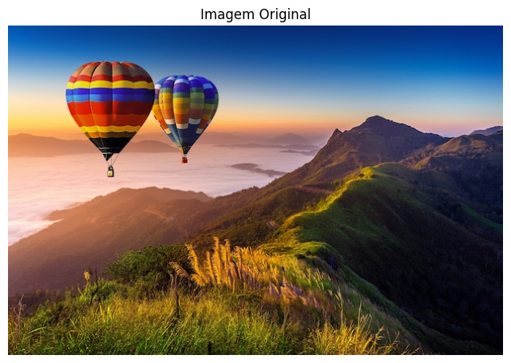

# 🚀 Recolorização de Imagens com K-Means

Este projeto demonstra a aplicação do algoritmo K-means para realizar a **quantização de cores** em uma imagem. O objetivo principal é reduzir o número de cores distintas, agrupando pixels com cores semelhantes em um número predefinido de clusters (`k`).

## 🎨 O Projeto

O objetivo é transformar uma imagem com uma rica variedade de cores em uma nova versão com um número limitado de cores, neste caso, **k=5**.

Essa técnica pode ser útil para diversos fins, como compressão de imagens, simplificação visual ou criação de efeitos artísticos, evidenciando como o K-means pode ser aplicado em problemas de processamento de imagens.

### Resultados com k=5

Como podemos ver abaixo, a imagem original é transformada, e todos os seus pixels são remapeados para um dos 5 centróides (cores médias) encontrados pelo algoritmo.

| Imagem Original | Imagem Recolorizada (k=5) |
| :---: | :---: |
|  |  |

## 💡 Metodologia

O processo de quantização de cores foi implementado seguindo os seguintes passos:

1.  **Carregamento e Preparação:**
    * A imagem é carregada usando `matplotlib.image.imread`.
    * A matriz da imagem, com shape (altura, largura, 3), é reformatada para uma lista 2D de pixels, onde cada linha é um pixel com 3 valores (R, G, B). O shape se torna `(altura * largura, 3)`.
    * Os valores dos pixels são normalizados para o intervalo [0, 1] para facilitar o processamento pelo K-means.

2.  **Implementação do K-Means:**
    * Uma classe `KMeans` própria foi implementada do zero (`from scratch`) para demonstrar o funcionamento do algoritmo. Esta classe inclui métodos para `classificacao` (atribuir pixels aos clusters) e `treinamento` (atualizar os centróides).

3.  **Recolorização:**
    * O modelo K-means treinado atribui um "rótulo" (ID do cluster, de 0 a 4) para cada pixel da imagem.
    * Uma nova imagem é construída onde cada pixel original é substituído pela cor média (centróide) do cluster ao qual ele foi atribuído.

## 🛠️ Tecnologias Utilizadas

* **Python**
* **NumPy:** Para manipulação de matrizes e cálculos numéricos.
* **Matplotlib:** Para carregar, processar e exibir as imagens.
* **Scikit-learn:** Para a implementação principal do `KMeans`.
